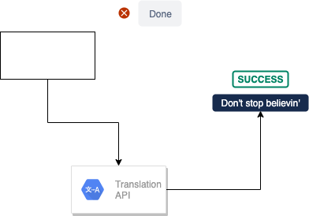
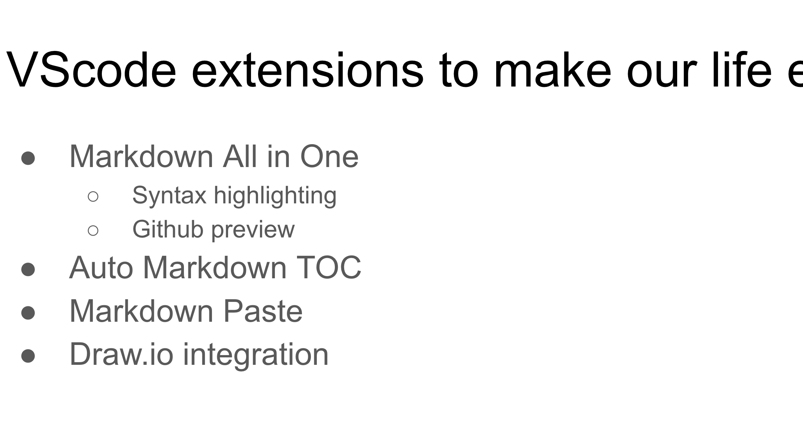

<!-- TOC -->

- [Título](#título)
  - [Subtítulo](#subtítulo)
  - [Otra](#otra)

<!-- /TOC -->

# Título

Contenido

## Subtítulo

Esto es otro apartado. Esto es una **negrita**
Esto es `código`

## Otra

